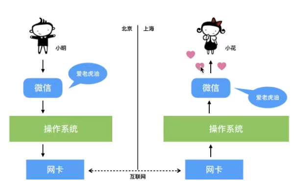

# Python高级

# 一、Linux

**学习目标**

- 能够掌握常见的linux文件目录结构
- 能够使用ls命令查看当前目录下的所有文件
- 能够使用pwd查看当前操作路径
- 能够说出绝对路径和相对路径及其作用
- 能够分别使用 touch和 mkdir创建文件和文件夹
- 能够使用cd切换根目录、家目录、当前目录和上层目录
- 能够使用tab自动补全功能
- 能够使用 clear清空屏幕操作
- 能够使用rm删除文件或者文件夹
- 能够使用mv移动或者重命名文件和文件夹
- 能够使用日历指令查看近3个月日历，并能把时间格式显示为：“xxx年xx月xx日xx时xx分xx秒”
- 能够使用 history显示近20条历史指令
- 能够使用cat命令、more查看文件以及管道 | 的使用方法

## 1.1 操作系统

操作系统（Operating System简称OS）是管理和控制计算机硬件与软件资源的计算机程序，是直接
运行在“裸机”上的最基本的系统软件，任何其他软件都必须在操作系统的支持下才能运行。

**一个例子说明操作系统**

 

**操作系统的作用**

- 操作系统作用可以简单总结为：对下控制硬件运行，对上为应用程序提供支持
- 是现代计算机系统中最基本和最重要的系统软件
- 是配置在计算机硬件上的第一层软件，是对硬件系统的首次扩展
- 主要作用是管理好硬件设备，并为用户和应用程序提供一个简单的接口，以便于使用
- 而其他的诸如编译程序、数据库管理系统，以及大量的应用软件，都直接依赖于操作系统的支持

**操作系统的分类**

- 桌面操作系统
- 服务器操作系统
- 嵌入式操作系统
- 移动设备操作系统

---

**linux内核**

内核（kernel）是系统的心脏，提供操作系统的最基本的功能，它负责管理系统的进程内存，设备驱动程序文件和网络系统决定着系统的性能和稳定性（linux内核是用C语言编写开源程序）

**Linux发新版：**Linux发行版本= Linux内核+一套软件+使用手册，常见的有CentOS，Reahat，Ubuntu。

**Linux领域：** 服务器领域（主要）、嵌入式领域、个人电脑领域

## 1.2 Linux指令

