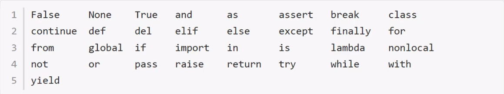

# Pycharm的基础设置

==考虑使用xmind==

[file]--[Setting]/[Defaut Settings]

**修改代码文字格式**

[Editor]--[Font]

- Font：修改字体
- Size：修改字号
- Line Spacing：修改行间距

**修改解释器**

[Project:项目名称]--[Project Interpreter]--[设置图标]--[Add]--浏览到目标解释器--[OK]--[OK]

 

**项目管理**

[File]--[Open]--浏览选择目标项目根目录--[ok]--选择打开项目方式

打开项目的方式三种：

 

1、This Window

覆盖当前项目，从而打开目标项目

2、New Window

在新窗口打开，则打开两次Pycharm,每个pycharm负责一个项目

3、Attach

一个窗口下打开多个项目，也就是多个项目重叠（本人比较喜欢这种，一眼尽收眼底）

**项目关闭**： [File]-[Close Project]/[Close Project in current window]

---

# 一、Python基础语法

## 1.1 注释

```
第一种(快捷键：ctrl+/)：  #     
第二种：
        """
        """
```

## 1.2 变量

**定义变量**

```
变量名 = 值
```

> 变量名自定义，要满足==标识符==命名规则


**标识符**

标识符命名规则是 Python中定义各种名字的时候的统一规范，具体如下

- 由数字、字母、下划线组成
- 不能数字开头
    不能使用内置关键字
- 严格区分大小写

   

**命名习惯：**

- 见名知义。
- 大驼峰：即每个单词首字母都大写，例如：`MyName`
- 小驼峰：第二个（含）以后的单词首字母大写，例如：`myName`
- 下划线：例如：`my_name`

---

**使用变量：**

```python
my_name = "jiajikang"
```

## 1.3 认识bug&Debug工具

所谓bug，就是程序中的错误。如果程序有错误，需要程序员排查问题，纠正错误。

Debug工具是PyCharm IDE中集成的用来调试程序的工具，在这里程序员可以查看程序的执行细节和
流程或者调解bug。

**Debug工具使用步骤：**

1. 打断点
2. Debug调试

---

### 1.3.1 打断点

**断点位置：**目标要调试的代码的第一行代码即可，即第一个断点。

**打断点的方法：** 单击目标代码的行号右侧空白位置

### 1.3.2 Debug调试

第一步：Debug运行

 

第二步：

 

 

## 1.4 数据类型

​	在 Python里为了应对不同的业务需求，也把数据分为不同的类型。

 

> <font color=red>说明</font>：使用`type()`函数实现查看数据具体的类型


## ==1.5 变量章节总结==

- 定义变量的值 

    ```
    变量名 = 值
    ```

- 标识符

    由数字、字母、下划线组成

    不能数字开头

    不能使用内置关键字

    严格区分大小写

- 数据类型

    整型：int

    浮点型：float

    字符串：str

    布尔型：bool

    元组：tuple

    集合：set

    字典：dict

## 1.6 输出

- 格式化输出

    格式化符号

    f-字符串

- print的结束符


```python
print('hell')
age = 18
print(age)
```

### 1.6.1 格式化输出


 

**技巧：**

- %06d，表示输出的整数显示位数，不足以0补全，超出当前位数则原样输出
- %.2f，表示小数点后显示的小数位数。


### 1.6.2 输出_格式化基础

所谓的格式化输出即按照一定的格式输出内容。

**格式化符号**

```python
# 格式化符号输出数据
age = 18
name = "jiajikang"
weight = 120.3
stu_id = 1
print('%d岁' % age)
print('%s' % name)
print('%.2f' % weight)# 小数点后面保存2位
```


### 1.6.3 输出_格式化高级使用

```python
print('%d' % stu_id)
# 例如学号001
print('%03d' % stu_id) # %06d，表示输出的整数显示位数，不足以0补全，超出当前位数则原样输出

print('名字%s, 今年年龄%d' %(name,age) )
print('名字%s, 明年年龄%d' %(name,age+1) )
print('名字%s,年龄%d,体重%f,学号%d' % (name,age,weight,stu_id))
```

 ### 1.6.4 输出_拓展格式化字符串

```python
name = 'tom'
age = 13
weight = 12.3

print('名字%s，年龄%s， 体重%s' % (name,age,weight)) # 都可以使用%s

```

### 1.6.5 输出_f-格式化字符串

格式化字符串除了%s，还可以写成：`f{表达式}`

```python
age = 23
name = 'tom'
print('名字%s，年龄%s， 体重%s' % (name,age,weight)) # 都可以使用%s

# 语法：f{表达式}
print(f'名字是{name}, 年龄{age}') # 比%s更高效一点
```

### 1.6.6 输出_转义字符

- `\n`：换行
- `\t`：制表符，一个tab键（4个空格）距离

```python
print('hell \n python') # 换行
print('\tabcd') # 四个制表符
```

### 1.6.7 输出_print结束符

```python
print('输出的内容',end='\n')
print('hello',end='\t')
print('word')
print('hello',end='...')
```

> 在 Python中， print()，默认自带end="\n"这个换行结束符，所以导致每两个print直接会换行展示，用户可以按需求更改结束符。

### ==1.6.8 输出_总结==

- 格式化符号

    %s：格式化输出字符串

    %d：格式化输出整数

    %f：格式化输出浮点数

- f-字符串

    f'{表达式}'

- 转义字符

    \n：换行

    \t：制表符

- print结束符

    ```python
    print('内容',end="")
    ```


## 1.7 输入

在 Python中，程序接收用户输入的数据的功能即是输入。

**目标：**

- 输入功能的特点
- 输入input的特点

**输入语法：**

```python
input('提示信息')
```

**输入的特点：**

- 当程序执行到`input` ，等待用户输入，输入完成之后才继续向下执行
- 在python中，`input`接收用户输入后，一般存储到变量，方便使用。
- 在python中，`input`会把接收到的任意输入的数据当做**字符串**处理。

**输入功能的实现：**

```python
password=input('请输入您的密码：')
print(f'您输入的密码是{password}')
print(type(password)) # str
```

## 1.8 转换数据类型

- 数据类型转换的必要性
- 数据类型转换常用方法

**转换数据类型的作用：**

问：input()接收用户输入的数据都是字符串类型，如果用户输入1，想得到整型该如何操作

答：转换数据类型即可，即将字符串类型转换成整型

**转换数据类型的函数：**

   

```python
num = input('请输入数字：')
print（num）
print(type(num)) # str
print(type(int(num))) # int

num1 = 1
str1 = '10'
print(type(float(num1))) # float
print(float(num1)) # 1.0

print(float(str1)) # 10.0

#数据转换成字符串
print(type(str(num1)))

# 3、tuple()将一个序列转换成元组
list1 = [10,20,30]
print(type(tuple(list1))) # 

#将一个序列转换成列表
t1 = (100,200,300)
print(list(t1)) # [100,200,300]

# 计算在字符串中有效python表达式，并返回一个对象
str2 = '1'
str3 = '1.1'
str4 = '(100,200,300)'
str5 = '[100,200,300]'
print(type(eval(str2))) # int
print(type(eval(str3))) # float
print(type(eval(str4))) # tuple
print(type(eval(str5))) # list

```

##1.9 转换类型总结

- 转换数据类型常用的函数

- [ ] int()
- [ ] float()
- [ ] list()
- [ ] tuple()
- [ ] eval() 

## 1.10 pychrm交互式开发

```
左下角：python Console
关闭交互式开发环境：1、右侧“-”；2、file-close project
```

  


# 二、运算符

**运算符的分类：**

●  算数运算符

● 赋值运算符

● 复合赋值运算符

● 比较运算符

● 逻辑运算符

---

##2.1 **算术运算符**

```python
+
-
*
/
// # 整除
%  # 取余
** # 指数
() # 小括号
```

> 混合运算优先级顺序：`（）`高于`**`高于`*` `/` `//` `%` 高于 `+` `-`


---

##2.2 **赋值运算符**

- 单个变量赋值

```python
num = 1
print(num)
```

- 多个变量赋值

```python
num1, float1, str1 = 10,0.5, 'hello world'
print(num1)
print(float1)
print(str1)
```

- 多变量赋相同值

```python
a = b = 10
print(a)
print(b)
```

## 2.3 复合赋值运算符

```python
+=
-=
*=
/=
//= # 整除赋值运算符  c//=a -> c =c//a
%=  # 取余赋值运算符  c%=a  -> c = c%a 
**= # 幂赋值运算符    c**=a -> c = c**a
```

```python
a = 100
a += 1
# 输出101 a = a+1 ，最终a = 100+1
print(a) # 101

b = 10
b -= 1 # b = b-1
print(b) # 9

#注意： 先算复合运算符右边的表达式；算复合赋值运算
c = 10
# c +=3 -- c=c+3
c += 1+2 # c= c+1+2
print(c) # 13

d = 10
d*=1+2
print(d) # 30

```

## 2.4 比较运算符

比较运算符也叫关系运算符，通常用来判断。

 


## 2.5 逻辑运算符

 

```python
a = 1
b = 2
c = 3
# 与
print((a<b) and (b<c)) # True
print((a>b) and (b<c)) # False
# 或
print((a>b) or (b<c)) # True
# 非：取反
print(not False) # True
print(not (a>b)) # True
```

**拓展：数字逻辑运算符**

```python
a = 0
b = 1
c = 2

# and运算符，只要有一个值为0，则结果为0，否则结果为最好一个非0数字
print(a and b) # 0
print(b and a) # 0
print(a and c) # 0
print(c and a) # 0
print(b and c) # 2
print(c and b) # 1

#or运算符，只有所有值为0结果才为0，否则结果为第一个非0数字
print(a or b) # 1
print(a or c) # 2
print(b or c) # 1
```

## ==2.6 运算符总结==

- 算符运算的优先级

    混合运算优先级顺序： `（）`高于`**`高于`*` `/` `//` `%` 高于 `+` `-`

- 赋值运算符

    =

- 复合运算符

    +=

    -=

    优先级

    ​       1、先算复合赋值运算符右测的表达式

    ​       2、再算复合赋值运算的算数运算

    ​       3、最后算赋值运算

- 比较运算符

    判断相等：==

    大于等于：>=

    小于等于：<=

    不等于：!=

- 逻辑运算符

    与：and

    或：or

    非：not

# 三、条件语句

假设一个场景：

- 同学们这个年龄去过网吧吗？
- 去网吧进门想要上网必须做的一件事是做什么？（考虑重点）
- 为什么要把身份证给工作人员？
- 是不是就是为了判断是否成年？
- 是不是如果成年可以上网？如果不成年则不允许上网？

其实这里所谓的判断就是条件语句，即条件成立执行某些代码，条件不成立则不执行这些代码。

##3 .1 语法

```python
if 条件:
   条件成立执行的代码1
   条件成立执行的代码2
   ...
```

**快速体验：**

```python
if True:
    print("条件成立执行的代码1")
#注意：在这个下方的没有加缩进的代码，不属于if语句块，即和条件成立与否无关
print("这个代码成立嘛？")
```

##3.2 实例

需求分析：如果用户年龄大于等于18岁即成年，输出已经成年，可以上网"。

```python
age = 20
if age >= 18:
    print("可以上网")
 print("系统关闭")   
```

**进阶版：**新增需求：用户可以输出自己的年龄，然后系统进行判断是否成年，成年则输出您的年龄是用户输入
的年龄'，已经成年，可以上网"。

```python
#1、用户输入
#2、保存用户输入的年龄
#3、if
age = input("请输入年龄：")
age = int(age)
if age >= 18:
    print(f'您输入的年龄是{age},已经成年，可以上网')

```


---

**if...else...**

```python
#1、用户输入
#2、保存用户输入的年龄
#3、if
age = input("请输入年龄：")
age = int(age)
if age >= 18:
    print(f'您输入的年龄是{age},已经成年，可以上网')
else:
    print(f'您输入的年龄是{age},未成年，不可以上网')
```

> 注意：如果某些条件成立执行了相关的代码，那么其他的情况的代码解释器根本不会执行。

## 3.3 多重判断

>思考：中国合法工作年龄为18-60岁，即如果年龄小于18的情况为童工，不合法；如果年龄在18
>-60岁之间为合法工龄；大于60岁为法定退休年龄。

```python
if 条件1：
    条件1成立执行的代码
elif 条件2：
    条件成立执行的代码
...
else:
    以上条件都不成立执行的代码

```

> 多重判断也可以和else配合使用。一般else放到整个if语句的最后，表示以条件都不成立的时候
> 执行的代码。

```python
"""
1、用户输入自己的年龄
2、做判断
3、输出提示信息：您输入的年龄：，合法与否
"""
age= input('请您输入年龄：')
age = int(age)
if age<18:
    print(f'您输入的年龄是{age},童工')
elif (age>=18) and (age<=60):
    print(f'您输入的年龄是{age},合法')
elif age>60:
    print(f'您输入的年龄是{age},退休年龄')

```


----

**if嵌套：**

```
if 条件1：
    条件1成立执行的代码
    if 条件2：
        条件2成立执行的代码
```

> 条件2的if也是出于条件1的缩进关系内部

**实例：**

```python
"""
1、准备将来要做判断的数据：钱和空座位
2、判断是否有钱：上车 和 不能坐上车
3、上车了：判断是否能坐下：有空座位 和 无空座位
"""
money = 1
seat = 1
if money == 1:
    print('土豪，请上车')
    #判断能否坐车
    if seat ==1:
        print('有空座，坐下了')
    else:
        print('没有空座，站着吧你')
else:
    print('土鳖，跑着去')
```

**if嵌套执行流程**

 


## 3.4 综合应用

需求分析：

- 参与游戏的角色

    玩家

    ​        手动出拳

    电脑

    ​        随机出拳

- 判断输赢

    玩家获胜

    平局

    电脑获胜

```python
"""
1、出拳
      玩家：手动输入
      电脑：1.固定 ：剪刀；2. 随机
      
2、判断输赢
   玩家获胜
   平局
   电脑获胜

"""
import random
player = int(input("请出拳：0--石头；1--剪刀；2--布"))
#电脑
#computer = 1
computer = random.randint(0,2)
print(computer)

# 2、判断输赢
if ((playter==0) and (computer==1) and (playter==1) and (computer==2) and (playter==2) and (computer==0)):
    print('玩家赢')
elif player == computer:
    print('平局')
else:
    print('电脑赢')

```

**随机数做法：**

```
import 模块名
random.randint(开始,结束)
```

```python
import random
num = random.ranint(0,2)
print(num) # 一个随机整数0,1,2

```

# <font color=red>四、三目运算符</font>

```python
条件成立执行的表达式 if 条件 else 条件不成立执行的表达式
```

```python
a = 1
b = 2
c = a if a>b else b
print(c) # 2

# 需求：有两个变量，比较大小，变量1 大于 变量2 执行 变量1 - 变量2； 否则 变量2 - 变量1
aa = 10
bb = 6
c = aa-bb if aa>bb else bb--aa
print(c) # 4

```

# 五、循环语法

**目标：**

- 了解循环
- while语法【重点】
- while应用
- break和continue和
-  while循环嵌套【重点】
-  while循环嵌套应用【难点】
- for循环

---

## 5.1  循环的分类

在python中，循环分为 `while` 和 `for` 两种，最终实现效果相同。

###5.1.2 while语法

```
while 条件：
    条件成立重复执行的代码1
    条件成立重复执行的代码1
    ...
```

**快速体验：**需求：复现重复执行100次 `print('媳妇，我错了')`（输出更简洁一些，我们这里设置5次）。

```python
i = 1
while i<=5:
    print('媳妇我错了')
    i += 1
print('任务结束')
```

**计数器习惯书写**

```python
i = 0
while i<5:
    print('媳妇我错了')
    i += 1
print('任务结束')
```

**解释器如何执行：**

```python
# 采用Debug每步每步执行
i = 0
while i<5:
    print('媳妇我错了')
    i += 1
print('原谅你了')
```


---


**while应用一:**

```python
"""
分析：1-100的累加和，即1+2+3+4+即前两个数字的相加结果+下一个数字（前一个数字+1）
"""
i = 0
sum = 0
while i<100:
    sum +=i
    i += 1

print(f'sum={sum}')

```

**while应用二:**

```python
"""
分析：1-100的偶数和，即2+4+6+8得到偶数的方法如下：
偶数即是和2取余结果为0的数字，可以加入条件语句判断是否为偶数，为偶数则累加
初始值为0/2，计数器每次累加2

"""
```

```python
# 方法一：条件判断和2取余数则累加
i = 1
result = 0
while i <= 100:
    if i % 2 == 0:
        result += i
    i += 1
print('result=%d' % result)
```

```python
# 方法二：计数器控制增量2
i = 2
result = 0
while i<=100:
    result += i
    i += 2
print(result) 
```

### 5.1.2 while循环嵌套

```python
while 条件:
    while 条件：
        print('媳妇我错了')
    print('刷晚饭的碗')
```

```
while 条件1：
    条件1成立的执行的代码
    ...
    while 条件2：
    条件2成立执行的代码

```

**快速体现：**

```python
j = 0
while j<3:
    i =0
    while i<3:
        print('媳妇我错了')
        i+=1
    print('刷碗')    
```

###5.1.3 break和continue

break和continue是循环中满足一定条件退出循环的两种不同方式。

**break**：当某些条件成立，退出当前循环

```python
i = 1
while i <= 5:
    if i==4:
        print(f'吃饱了不吃了')
        break
    print(f'吃了第{i}个苹果')
    i += 1
```

**continue**：当某些条件成立时候，退出当前循环，继而执行下一次循环

```python
i = 1
while i<=5:
    if == 3:
        print('有虫子,这个苹果不说了')
        # 如果使用continue，在continue之前一定要修改计数器，否则进入死循环
        i += 1
        continue
    print(f'吃了第{i}个苹果')
    i += 1
```


### 5.1.4 while循环嵌套应用

**应用一：**

```python
j = 0
while j<5:
    # 一行星星开始
    i = 0
    while i<5:
        print('*'，end='')
        i += 1
    # 一行星星结束    
    print() # 默认换行
    j+=1
```

**应用二：**

```python
# 三角形：每行星星的个数和行号数相等
j = 0
while j<5:
    # 一行星星开始
    i = 0
    # i表示每行里面星星的个数，这个数字要和行号相等所以i要和j联动
    while i<=j: 
        print('*'，end='')
        i += 1
    # 一行星星结束    
    print() # 默认换行
    j+=1
```

**应用三：**

```python
#重复打印9行乘法表达式
"""
1、打印一个乘法表达是：x * x = x*x
2、一行打印多个表达式--一行表达式的个数和行数相等 -- 循环：一个表达式，不换行

"""
j = 1
while j<=9:
    #一行的表达式开始
    i = 1
    while i<=j:
        print(f'{i} * {j} = {i*j}',end='\t')
        i += 1
    #一行表达时的结束
    print()
    j += 1

```

### 5.1.5 for循环

```python
for 临时变量 in 序列：
    重复执行的代码1
    重复执行的代码2
    ......
```

```python
str1 = 'jiajikang'
for i in str1:
    print(i)
```

####1、**break退出for循环**

```python
str1 = 'itheima'
for i in str1:
    if i == 'e':
        break
    print(i) # i t h
```

#### 2、continu退出for循环

```python
str1 = ‘itheima’
for i in str1:
    if i == 'e':
        continue
    print(i) # i t h i m a 
```

## 5.2 while...else

循环可以和else配合使用，else下方缩进的代码指的是当循环正常结束之后要执行的代码。

**while...else**

需求：女朋友生气了，要惩罚：连续说5遍“媳妇儿，我错了”，如果道歉正常完毕女朋友就原谅我了，这
个程序怎么写？

```python
i = 1
while i <= 5:
    print('媳妇我错了')
    i += 1
print('媳妇原谅我了')
```

**while...else语法**

```python
while 条件：
    条件成立重复执行的代码
else：
    循环正常结束之后要执行的代码
```

```python
i = 1
while i <= 5:
    print('媳妇我错了')
    i += 1
else:
    print('原谅我了')

```

###5.2.1 while...else之break和continue

**break:**

```python
i = 1
while i<5:
    if i==3:
        print('这边说的不真诚')
        break
    print('媳妇我错了')
    i += 1
else:
    print('媳妇原谅我了')
```

>  所谓else指的是循环正常结束之后要执行的代码，即如果是 break终止循环的情况，else下方缩进的代码将不执行。


**continue:**

```python
i = 1
while i<5:
    if i==3:
        i +=1
        print('这边说的不真诚')
        continue
    print('媳妇我错了')
    i += 1
else:
    print('媳妇原谅我了')
```

>因为 continue是退出当前一次循环，继续下一次循环，所以该循环在 continue控制下是可以正常结束的，当循环结束后，则执行了else缩进的代码。

## 5.3 for...else

```python
for 临时变量 i 序列：
    重复执行的代码
    ...
else:
    循环正常结束之后要执行的代码
```

```python
str1 = 'itheima'
for i in str1:
    print(i)
else:
    print("循环正常结束之后，执行的代码")
```

### 5.3.1 for...else之break和continue

**break：**

```python
str1 = 'itheima'
for i in str1:
    if i == 'e':
        break
        #continue
    print(i)
else:
    print('循环正常结束执行的else代码')
```

**continue：**

```python
str1 = 'itheima'
for i in str1:
    if i == 'e':
        #break
        continue
    print(i)
else:
    print('循环正常结束执行的else代码')
```

# 六、字符串

**目标：**

- 认识字符串
- 下标
- 切片
- 常用操作方法

## 6.1 认识字符串

字符串是 Python中最常用的数据类型。我们一般使用引号来创建字符串。创建字符串很简单，只要为变量分配一个值即可。

```python
a = 'hello' \ 
     'world'
b = 'abcdefg'
print(type(a)) # str
print(type(b)) # str

# 三引号
e = '''i am tom'''
print(type(e)) # str
f = """i am tom"""
print(type(f)) # str

# 转义字符问题
# I'm Tom
c = " I'm Tom "
print(c) #  I'm Tom
print(type(c)) # str

# d = ' I'm Tom '
d = ' I\'m Tom '
print(d) #  I'm Tom
print(type(d)) # str

```

## 6.2  字符串输出

```python
print('hello wolrd')

name = 'Tom'
print(f'我的名字是%s' % name)
print(f'我们的名字是{name}')

```

## 6.3 字符串输入

在python中，使用 `input()` 接收用户输入

```python
name = input('请输入名字：')
print(f'您输入的名字是{name}')
print(type(name)) # str

password = input('请输入您的密码：')
print(f'您输入的密码是{password}')
print(type(password)) # str
# 总结：无论是字符串还是数字都是str类型
```


## 6.4 下标

==下标==又叫==索引==，就是编号。比如火车座位号，座位号的作用：按照编号快速找到对应的座位。同理，下标的作用就是通过下标快速找到对应的数据。

```python
str1 = 'abcdefg'
print(str1)

# 想得到数据a字符，得到数据b字符 -- 使用字符串中某个特定的数据
# 这些字符数据从0开始顺序分配一个编号 -- 使用这个编号精确找到某个字符数据-- 下标或者索引或索引值
print(str1[0]) # a
print(str1[1]) # b

```

## 6.5 切片

### 6.5.1 切片简介

```python
str1 = 'abcdefg'
print(str1) # 获取整个

# 下标得到的是下标为某个数字的数据
print(str1[2]) # c
# 得到abc这三个数据该怎么办？
```

切片是指对操作的对象截取其中一部分的操作。**字符串、列表、元组**都支持切片操作。

---

**语法：**

```
序列[开始位置下标 ：结束位置下标 ：步长]
```

> 注意

1、不包含结束位置下标对应的数据，正负整数均可.

2、步长是选取间隔，正负整数均可，默认步长为1.

### 6.5.2 切片体验

```python
name = 'abcdefg'
print(name[2:5:1]) # cde
print(name[2:5]) # cde
print(name[:5]) # abcde  -- 如果不写开始，默认从0开始选取
print(name[2:]) # cdefg  -- 如果不写结束，表示选取到最后
print(name[:]) # abcdefg -- 如果不写开始和结束，表示选取所有

# 负数测试
print(name[::-1])  #gfedcba 如果步长为负数，表示倒序选取
print(anme[-4:-1]) # def 下标-1表示最后一个数据，依次向前类推

#终极测试
print(name[-4:-1:1]) # def
print(name[-4:-1:-1]) # 不能选取数据，从-4开始到-1结束，选取方向为从在到右，但是-1步长，从右向左选取
# ***** 如果选取方向(下标开始到结束的方向) 和 步长的方向冲突，则无法选取数据
print(name[-1:-4:-1]) # 要方向一致，才能选取数据
```

##6.6 字符串常用方法

字符串的常用操作方法有**查找、修改和判断**三大类。

### 6.6.1 查找find()和index()

所谓字符串查找方法即是查找子串在字符串中的位置或出现的次数。

- find()：检测某个子串是否包含在这个字符串中，如果在返回这个子串开始的位置下标，否则则返回-1。

**1、语法**

```
字符串序列.find(子串，开始位置下标，结束位置下标)
```

> 注意：开始和解书位置下标可以省略，表示在整个字符串序列中查找。

**2、快速体验**

```python
mystr = "hello world and itcast and iteima and python"

print(mystr.find('and')) # 12
print(mystr.find('and', 15, 30)) # 23
print(mystr.find('ands')) # -1
```


----


- index()：检测某个子串是否包含在这个字符串中，如果在返回这个子串开始的位置下标，否则则报异常

**1、语法**

```
字符串序列.index(子串，开始位置下标，结束位置下标)
```

> 注意：开始和结束位置下标可以省略，表示在整个字符串徐柳中查找。

**2、快速体验**

```python
mystr = "hello world and itcast and iteima and python"

print(mystr.index('and')) # 12
print(mystr.index('and', 15, 30)) # 23
print(mystr.index('ands')) # 如果index查找子串不存在，会报错
```


---


- count（）

**1、语法**

```
字符串序列.count(子串，开始位置下标，结束位置下标)
```

**2、快速体验**

```python
mystr = "hello world and itcast and iteima and python"

print(mystr.count('and',15,30)) # 1
print(mystr.count('and')) #  3
print(mystr.count('ands')) #  3
```


---

- rfind()：和find()功能相同，但查找方向从==右侧==开始
- rindex()：和index()功能相同，但查找方向为==右侧==开始
- count()：返回某个子串在字符串中出现的次数

```python
mystr = "hello world and itcast and iteima and python"
print(mystr.rfind('and')) # 1
```

### 6.6.2 修改

所谓修改字符串，指的就是通过函数的形式修改字符串中的数据。

- replace()： 替换

**1、语法**

```
字符串序列.replace(旧字符串，新子串，替换次数)
```

> 注意：替换次数如果查出子串出现的数据，则替换次数为该子串出现的次数

**2、快速体验**

```python
mystr = "hello world and itcast and iteima and python"
print(mystr.replace('and', 'he')) # hello world he itcast he iteima he python

print(mystr.replace('and', 'he', 10)) # 替换次数如果超出字串出现的次数，表示替换所有这个字串
print(mystr)

#**** 调用了replace函数后，发现原有字符串的数据并没有做到修改，修改后的数据是replace函数的返回值
#--- 说明 字符串是不可变数据类型
#数据是否可以改变划分为 可变类型 和  不可变类型
```

> 注意：数据按照是否能直接修改分为可变类型和不可变类型两种。字符串类型的数据修改的时候
>
> 不能改变原有字符串，属于不能直接修改数据的类型即是不可变类型。


---


- split()：按照指定字符分割字符串  ---  分割， 返回一个列表， 丢失分割字符

**1、语法**

```
字符串序列.split(分割字符，num)
```

> 注意：num表示的是分割字符出现的次数，即将来返回数据个数为num+1个。

**2、快速体验**

```python
mystr = "hello world and itcast and iteima and python"

list1 = mystr.split('and')
# ['hello world ', ' itcast ', ' iteima ', ' python']
print(list1)
```


---


- join()： 用一个字符或子串合并字符串，即是将多个字符串合并为一个新的字符串

**1、语法**

```python
字符或者子串.join(多字符串组成的序列)
```

**2、快速体验**

```python
list1 = ['chuan', 'zhi', 'bo', 'ke']
t1 = ('aa','b','cc','ddd')
#chuan...zhi...bo...ke
#<class 'str'>
new_list1 = '...'.join(list1)
print(new_list1)

```

### 6.6.3 修改之大小写转换

- capitalize()： 将字符串第一个字符转换成大写

```python
mystr = "hello world and itcast and iteima and python"
# Hello world and itcast and iteima and python
print(mystr.capitalize())

```

> 注意：capitalize()函数转换后，字符串第一个字符大写，其他的字符全是小写


---

- title()：将字符串每个单词首字母转换成大写。

```python
mystr = "hello world and itcast and iteima and python"
# Hello World And Itcast And Iteima And Python
print(mystr.title())
```


---

- lower()：将字符串中大写转换成小写

```python
mystr = "hello World and itcast and iteima and python"

print(mystr.lower())

```

  

---


- upper()：将字符串中小写转换成大写

```python
mystr = "hello World and itcast and iteima and python"

print(mystr.upper())
```


----


### 6.6.4 修改之删除空白字符

- lstrip()：删除字符串左侧空白字符
- rstrip()：删除字符串右侧空白字符
- strip()：删除字符串两侧空白字符（这里要注意和split函数注意区分）

```python
mystr = "     hello World and itcast and iteima and python     "
new_str = mystr.lstrip()
print(new_str)
```


### 6.6.5 修改之字符串对齐

- ljust()：返回一个原字符串左对齐，并使用指定字符（默认空格）填充至对应长度的新字符串。

1、语法

```
字符串序列.ljust(长度，填充字符)
```

2、快速检测

```python
mystr = 'hello'
print(mystr.ljust(10,'.')) # hello.....

```

- rjust()：返回一个原字符串右对齐并使用指定字符（默认空格）填充至对应长度的新字符串，语法和ljust()相同
- center()：返回一个原字符串居中对齐并使用指定字符（默认空）填充至对应长度的新字符串，语法和ljust()相同。


### 6.6.6 判断开头或结尾

所谓判断即是判断真假，返回的结果是布尔型数据类型：True或 False

- startswith()： 检查字符串是否是以指定子串开头，是则返回True，否则返回 False。如果设置开始和结束位置下标，则在指定范围内检查。

1、语法

```
字符串序列.startswitch(字串，开始位置下标，结束位置下标)
```

2、快速体验

```python
mystr = "hello World and itcast and iteima and python"
print(mysrt.startswith('hello')) # True

```

- endswith（）：与startswitch函数类似

```python
# endswitch()
print(mystr.endswitch('pythons')) # False
```


### 6.6.7 判断

- isalpha()：如果字符串至少有一个字符并且所有字符都是字母则返回True，否则返回False

```python
mystr1 = 'hello'
mystr2 = 'hello1234'

print(mystr1.isalpha()) # True

print(mystr2.isalpha()) # False

```

- isdigit()：如果字符串只包含数字则返回True否则返回False

```python
mystr1 = 'aaa23232'
mystr2 = '12121'
print(mystr1.isdigit()) # False
print(mystr2.isdigit()) # True
```

- isalnum：如果字符串至少有一个字符并且所有字符都是字母或者数字则返回True，否则返回Flase

```python
mystr1 = 'aaa2332'
mystr2 = '33434-'

print(mystr1.isalnum()) # True
print(mystr1.isalnum()) # False 
```

- isspace()：都是空白时，返回True

```python
mystr1 = ‘1 2 3 4’
print(mystr1.isspace()) # False 
```

# 七、列表

目标

- 列表的应用场景
- 列表的格式
- 列表的常用操作
- 列表的循环遍历
- 列表的嵌套使用

## 7.1 列表简介

**列表的应用场景**

思考：有一个人的姓名（TOM）怎么书写存储程序？

答：变量。

思考：如果一个班级100位学生，每个人的姓名都要存储，应该如何书写程序？声明100个变量吗？

答：列表即可，列表一次性可以存储多个数据。

**列表的格式**

```
[数据1，数据2，数据3，数据4.......]
```

列表可以一次性存储多个数据，且可以为不同数据类型。

##7.2 **列表的常用操作**

列表的作用是一次性存储多个数据，程序员可以对这些数据进行的操作有：**增、删、改、查。**

### 7.2.1 查找

#### 7.2.1.1 下标

```python
name_list = ['tome', 'lily', 'rose']

print(name_list[0]) # tome
print(name_list[1]) # lily
print(name_list[2]) # rose
```


#### 7.2.1.2 函数

- index()：返回指定数据所在位置的下标

1、语法

```
列表序列.index(数据，开始位置下标，结束位置下标)
```

2、快速体验

```python
name_list = ['tome', 'lily', 'rose']
print(name_list.index('lily',0,2)) # 1
```

> 注意：如果查找的数据不存在则报错


---


- count()：统计指定数据在当前列表中出现的次数。

```python
name_list = ['Tom', 'lily', 'rose']
print(name_list.count('lily')) # 1
```


---


- len()：访问列表长度，即列表中数据的个数

```python
name_list = ['Tom', 'lily', 'rose']
print(len(name_list)) # 3
```

### 7.2.2 查找数据之判断是否存在

- in：判断指定数据在某个列表序列，如果在返回True，否则返回Flase

```python
name_list = ['Tom', 'lily', 'rose']
print('lily' in name_list) # True

print('Lily' in name_list) # False
```

- not in：判断指定数据不在某个列表序列，如果不在返回True，否则返回 False

```python
name_list = ['Tom', 'lily', 'rose']
print('lily' not in name_list) # Flase

print('Lily' not in name_list) # True
```


**体验案例：**需求：查找用户输入的名字是否已经存在

```python
name_list = ['Tom', 'Lily', 'Rose']
name = input("请输入您要搜索的名字：")
if name in name_list:
    print(f'您输入的名字是{name},名字已经存在')
else:
    print(f'您输入的名字是{name},名字不存在')
```

### 7.2.3 列表添加数据

作用：增加知道数据到列表中

#### 7.2.3.1 列表添加数据之append

- append()：列表结尾追加数据

**1、语法**

```
列表序列.append(数据)
```

**2、快速体验**

```python
name_list = ['Tom', 'Lily', 'Rose']
name_list.append('JJK')
print(name_list) # ['Tom', 'Lily', 'Rose', 'JJK']
```

>列表追加数据的时候，直接在原列表里面追加了指定数据，即修改了原列表，故列表为可变类型数据。

**注意点：**如果 append（）追加的数据是一个序列，则追加整个序列到列表

```python
name_list = ['Tom', 'Lily', 'Rose']
name_list.append(['jjk','jiajikang'])
print(name_list) # ['Tom', 'Lily', 'Rose', ['jjk', 'jiajikang']]
```


#### 7.2.3.2 列表添加数据之extend

- extend（）：列表结尾追加数据，如果数据是一个序列，则将这个序列的数据逐一添加到列表。

1、语法

```
列表序列.extend(数据)
```

2、快速体验

**单个数据**

```python
name_list = ['Tom', 'Lily', 'Rose']
name_list.extend('jiajikang')
print(name_list) # ['Tom', 'Lily', 'Rose', 'j', 'i', 'a', 'j', 'i', 'k', 'a', 'n', 'g']
```

**序列数据**

```python
name_list = ['Tom', 'Lily', 'Rose']
name_list.extend(['jiajikang', 'jiajikang'])
print(name_list)  # ['Tom', 'Lily', 'Rose', 'jiajikang', 'jiajikang']
```

####7.2.3.3 列表添加数据之insert

- insert()：指定位置新增数据

**1、语法**

```
列表序列.insert(位置下标，数据)
```

**2、快速体验**

```python
name_list = ['Tom', 'Lily', 'Rose']
name_list.insert(1,"jiajiknag")
print(name_list)  # ['Tom', 'jiajiknag', 'Lily', 'Rose']
```


### 7.2.4 列表删除数据

- del 

1、语法

```
del 目标
```

2、快速体验

**删除列表**

```python
name_list = ['Tom', 'Lily', 'Rose']
def name_list
print(name_list) # 会报错

```

**删除指定数据**

```python
#del可以删除指定下标的数据
name_list = ['Tom', 'Lily', 'Rose']
del name_list[0]
print(name_list)
```


---


- pop()：删除指定下标的数据（默认为最后一个），并且返回该数据

1、语法

```
列表序列.pop(下标)
```

2、快速体验

```python
name_list = ['Tom', 'Lily', 'Rose']
del_name = name_list.pop(1)
print(del_name) # Lily
print(name_list) # ['Tom', 'Rose']
```


---


- remove()：移除列表中某个数据的第一个匹配项

1、语法

```
列表序列.remove(数据)
```

2、快速体验

```python
name_list = ['Tom', 'Lily', 'Rose']
name_list.remove('Rose')
print(name_list) # ['Tom', 'Lily']
```


---


- clear()：清空列表

```python
name_list = ['Tom', 'Lily', 'Rose']
name_list.clear()
print(name_list) # []
```


### 7.2.5 列表修改数据

- **修改指定下标数据**

```python
name_list = ['Tom', 'Lily', 'Rose']
name_list[0] = 'jiajiknag'
print(name_list) # ['jiajiknag', 'Lily', 'Rose']
```

- **逆置：reverse()**

```python
num_list = [1,2,3,4,5,6]
num_list.reverse()
print(num_list) # [6, 5, 4, 3, 2, 1]
```

- **排序**

1、语法

```python
列表序列.sort(key=None,reverse=False)
```

> 注意：reverese表示排序规则，reverse=True降序，reverse=False升序（默认）

2、快速体验

```python
list1 = [1,2,3,4,5,6,34,55,2,756,8]
list1.sort()
print(list1) # [1, 2, 2, 3, 4, 5, 6, 8, 34, 55, 756]
```


###7.2.6 列表复制数据

函数：copy()

```python
name_list1 = ['Tom', 'Lily', 'Rose']
name_list2 = name_list1.copy()
print(name_list2) # ['Tom', 'Lily', 'Rose']
```


###7.2.7 列表的循环遍历

#### 7.2.7.1 列表的循环之while

需求：依次打印列表中的各个数据

- 代码

```python
name_list1 = ['Tom', 'Lily', 'Rose']
i = 0
while i< len(name_list1):
    print(name_list1[i])
    i += 1
"""
Tom
Lily
Rose

"""
```


#### 7.2.7.2 列表的循环之for

- 代码

```python
name_list1 = ['Tom', 'Lily', 'Rose']
for i in name_list1:
    print(i)
"""
Tom
Lily
Rose

"""    
```

##7.3 列表嵌套

所谓列表嵌套指的就是一个列表里面包含了其他的子列表。

应用场景：要存储班级一、二、三三个班级学生姓名，且每个班级的学生姓名在一个列表。

```python
name_list = [['小明', '小红', '小绿'], ['Tom', 'Lily', 'Rose'], ['张三', '李四', '王五']]
```

思考：如何查找数据“李四”

```python
# 列表嵌套的时候的数据查找
# 第一步：按下标查找到李四所在的列表
print(name_list[2])
# 第二步：从李四所在的列表里面，再按下标找到数据李四
print(name_list[2][1]) # 整体，局部观察
```


---

**总和应用**

需求：有三个办公室，8位老师，8位老师随机分配到3个办公室

```python
"""
需求：有三个办公室，8位老师，8位老师随机分配到3个办公室
步骤：
    1、准备数据
       8位老师 -- 列表
       3个办公室 -- 列表嵌套
    2、分配老师到办公室
       随机分配
       就是吧老师的名字写入到办公室列表 -- 办公室列表追加老师名字数据
    3、验证是否分配成功
       打印办公室详细信息：每个办公室的人数和对应的老师名字

"""
import random
#1、准备数据
teachers = ['A', 'B', 'C', 'D', 'E', 'F', 'G', 'H']
offices = [[], [], []]

#2、分配老师到办公室 -- 取到每个老师放到办公室列表 -- 变量老师列表数据
for name in teachers:
    # 列表追加数据 -- append  extend  insert
    #xx[0] -- 不能指定是具体某个下标 -- 随机
    num = random.randint(0,2)
    offices[num].append(name)
#print(num)

#print(offices)
# 为了更贴近生活，把各个办公室子列表加一个办公室编号 1,2,3
i = 1
#3、验证是否分配成功
for office in offices:
    # 打印办公室人数 -- 子列表数据的个数 len()
    print(f'办公室{i}的人数是{len(office)},老师分别是：')
    # 打印老师的名字
    # print -- 每个子列表里面的名字个数不一定-- 遍历 -- 子列表
    for name in office:
        print(name)
```

# 八、元组

**目标**

- 元组的应用场景
- 定义元组
- 元组常见操作

## 8.1 元组的应用场景

思考：如果想要存储多个数据，但是这些数据是不能修改的数据，怎么做？

答：列表？列表可以一次性存储多个数据，但是列表中的数据允许更改。

```
num_list = [10,20,30]
num_list[0] = 100
```

==一个元组可以存储多个数据，元组内的数据是不能修改的。==

## 8.2 定义元组

元组特点：定义元组使用==小括号==，且==逗号==隔开各个数据，数据可以是不同的数据类型。

```python
t1 = (10,20,30) # 多个数据元组
t2 = (10,) # 单个数据元组

```

> 注意：如果定义的元组只有一个数据，那么这个数据后面也要==添加逗号==，否则数据类型为唯一的
> 这个数据的数据类型

```python
t2 = (10,)
print(type(t2)) # tuple

t3 = (20)
print(type(t3)) # int

t4 = ('hello')
print(type(t4)) # str
```


## 8.3 元组的常见操作

### 8.3.1 元组的常见操作之查找

元组数据不支持修改，只支持查找，具体如下：

- **按下标查找数据**

```python
tuple1 = ('aa', 'bb', 'cc', 'dd')
print(tuple1[0]) # aa
```

- **index()：**查找某个数据，如果数据存在返回对应的下标，否则报错，语法和列表、字符串的index方法相同。

```python
tuple1 = ('aa', 'bb', 'cc', 'dd')
print(tuple1.index('aa')) # 0
```

- **count()：**统计某个数据在当前元组出现的次数

```python
tuple1 = ('aa', 'bb', 'cc', 'dd', 'bb')
print(tuple1.count('bb')) # 2
```

- **len()：**统计元组中数据的个数

```python
tuple1 = ('aa', 'bb', 'cc', 'dd', 'bb')
print(len(tuple1)) # 5
```


### 8.3.2 元组的常见操作之修改

注意：元组内的直接数据如果修改则立即报错

```python
tuple1 = ('aa', 'bb', 'cc', 'dd', 'bb')
tuple1[0] = 'aaa'
```

但是如果元组里面有列表，修改列表里面的数据则是支持的，故自觉很重要。

```python
tuple2 =  (10,20, ['aa', 'bb', 'cc'], 50, 30)
print(tuple2[2]) # 访问到列表

tuple2[2][0] = 'aaaaaa'
print(tuple2)
"""
['aa', 'bb', 'cc']
(10, 20, ['aaaaaa', 'bb', 'cc'], 50, 30)
"""
```

# 九、字典

 **目标**

- 字典的应用场景
- 创建字典的语法
- 字典常见操作
- 字典的循环遍历

## 9.1 字典的应用场景

思考1：如果有多个数据，例如：Tom，男，20，如何快速存储？

答：列表

```
list1 = ['tom','男'，20]
```

思考2：如何查找到数据Tom'？

答：查找到下标为0的数据即可。

```
list1[0]
```

思考3：如果将来数据顺序发生变化，如下所示，还能用list1[0]访问到数据'Tom吗？

```
list1 = ['男','tom',20]
```

答：不能，数据Tom'此时下标为2

思考4：数据顺序发生变化，每个数据的下标也会随之变化，如何保证数据顺序变化前后能使用同一的
标准查找数据呢？

答：字典，字典里面的数据是以==键值对==形式出现，字典数据和数据顺序没有关系，即字典不支持下标，
后期无论数据如何变化，只需要按照对应的键的名字查找数据即可。

## 9.2 创建字典的语法

**字典特点：**

- 符号为大括号
- 数据为键值对形式出现
- 各个键值对之间用逗号隔开

```python
#有数据字典
dict1 = {'name' : 'jiajiknag', 'age':20, 'gender':'男'}
print(dict1)
#空字典
dict2 = {}
dict3 = dict() #函数创建
```

## 9.3 字典常用操作

### 9.3.1 增

**写法：**字典序列[key] = 值

**注意：**如果key存在则修改这个key对应的值；如果key不存在则新增此键值对。

```python
dict1 = {'name' : 'jiajiknag', 'age':20, 'gender':'男'}

dict1['name'] = 'jjk'
print(dict1)

dict1['id'] = 110
print(dict1) # {'name': 'jjk', 'age': 20, 'gender': '男', 'id': 110}
```

**注意：**字典为可变类型


### 9.3.2 删

- del()/del：删除字典或删除字典中指定键值对

```python
dict1 = {'name' : 'jiajiknag', 'age':20, 'gender':'男'}
#del(dict1) 
del dict1['gender']
print(dict1) # {'name': 'jiajiknag', 'age': 20}


```

- clear()：清空字典

```python
dict1 = {'name' : 'jiajiknag', 'age':20, 'gender':'男'}
dict1.clear()
print(dict1) # {}
```


### 9.3.3 改

**写法：**字典序列[key] = 值

**注意：**如果key存在则修改这个key对应的值；如果key不存在则新增此键值对。

```python
dict1 = {'name' : 'jiajiknag', 'age':20, 'gender':'男'}
dict1['name'] = 'JJK'
print(dict1) # 

dict1['ID'] = 1111
print(dict1)
```

### 9.3.4 查

#### 9.3.4.1 key值查找

```python
dict1 = {'name' : 'jiajikang', 'age':20, 'gender':'男'}
print(dict1['name']) # jiajikang
print(dict1['ID']) # 报错
```


#### 9.3.4.2 get()

- 语法

```
字典序列.get(key, 默认值)
```

- 注意：如果当前查找的key不存在则返回第二个参数（默认值），如果省略第二个参数，则返回
    None.

- 快速体验

```python
dict1 = {'name' : 'jiajikang', 'age':20, 'gender':'男'}
print(dict1.get('name')) # jiajikang
print(dict1.get('id',110)) # 110
print(dict1.get('id')) #None
```

#### 9.3.4.3 keys()

查找字典中所有的key，返回可迭代对象

```python
dict1 = {'name' : 'jiajikang', 'age':20, 'gender':'男'}
print(dict1.keys()) # dict_keys(['name', 'age', 'gender'])
```

#### 9.3.4.4 values()

查找字典中所有的value，返回可迭代对象

```python
dict1 = {'name' : 'jiajikang', 'age':20, 'gender':'男'}
print(dict1.values())# dict_values(['jiajikang', 20, '男'])
```

#### 9.3.4.5 items()

查找字典中所有的键值对，返回可迭代对象，里面的数据是元组，元组数据1是字典的key，元组数据2是字典key对应的value。

```python
dict1 = {'name' : 'jiajikang', 'age':20, 'gender':'男'}
print(dict1.items()) # dict_items([('name', 'jiajikang'), ('age', 20), ('gender', '男')])
```


## 9.4 字典的循环遍历

### 9.4.1  字典的循环遍历之key

```python
dict1 = {'name' : 'jiajikang', 'age':20, 'gender':'男'}
for key in dict1.keys():
    print(key) #
"""
name
age
gender

"""
```


###9.4.2  字典的循环遍历之value

```python
dict1 = {'name' : 'jiajikang', 'age':20, 'gender':'男'}
for value in dict1.values():
    print(value)
"""
jiajikang
20
男
"""
```

### 9.4.3  字典的循环遍历之元素

```python
dict1 = {'name' : 'jiajikang', 'age':20, 'gender':'男'}
for item in dict1.items():
    print(item)
    
"""
('name', 'jiajikang')
('age', 20)
('gender', '男')
"""
```

### 9.4.4 遍历字典的键值对

```python
dict1 = {'name' : 'jiajikang', 'age':20, 'gender':'男'}
for key, value in dict1.items():
    print(f'{key} = {value}')
    
"""
name = jiajikang
age = 20
gender = 男

"""
```

# 十、集合

创建集合使用 `{}` 或者 `set()`，但是如果要创建空集合只能使用 `set()`，因为 `{}` 用来创建空字典。

```python
s1 = {10,20,30,40,50}
print(s1)

s2 = set('abcddfdf')
print(type(s2)) # set
print(s2)

s3 = set()
print(type(s3)) # set

s4 = {}
print(type(s4)) # dict
```


## 10.1 集合常见操作

### 10.1.1 增加

- **add()**

```python
s1 = {10,20}
s1.add(100)
# 集合有去重功能，如果追加的数据是集合已有的数据，则什么事情都不做
s1.add(10)
print(s1)  # {100, 10, 20}
```

因为集合有去重功能，所以，当向集合内追加的数据是当前集合已有数据的话，则不进行任何操作。

- **update()，追加的数据是序列**

```python
s1 = {10,20}
s1.update([100,200])
s1.update('abc')
```


### 10.1.2 删除

- remove()，删除集合中指定数据，如果数据不存在则报错

```python
s1 = {10,20}
s1.remove(10)
print(s1) # 20

s1.remove(10) # 报错
print(s1)
```

- discard()，删除集合中指定数据，如果数据不存在也不会报错

```python
s1 = {10,20}
s1.discard(10)
print(s1) # {20}


s1.discard(10)
print(s1) # {20}
```

- pop()，随机删除集合中的某个数据，并返回这个数据

```python
s1 = {10,20,30,40,50}

del_num = s1.pop()
print(del_num)
print(s1)
```


###10.1.3 查找

- in：判断数据在集合序列
- not in：判断数据不在集合序列

```python
s1 = {10,20,30,40,50}
print(10 in s1) #True
print(10 not in s1) # False
```

# 十一、公共操作

**目标：**

- 运算符
- 公共方法
- 容器类型转换

## 11.1 运算符

 


### 11.1.1 +

```python
str1 = 'aa'
str2 = 'bb'
#列表
list1 = [1,2]
list2 = [10,20]
# 元组
t1 = (1,2)
t2 = (10,20)
dict1 = {'name':'python'}
dict2 = {'age':30}

# +:合并
str3 = str1 + str2
print(str3)

print(list1+list2)
print(t1+t2)

# 字典不支持+操作
```

### 11.1.2 *

```python
str1 = 'a'
list1 = ['hello']
t1 = ('word',)

# *:复制
print(str1*5)
#打印10个-
print('-'*10)

print(list1*5)
print(t1*5)

"""
aaaaa
----------
['hello', 'hello', 'hello', 'hello', 'hello']
('word', 'word', 'word', 'word', 'word')

"""
```

### 11.2.3 in and not in

```python
str1 = 'aa'
str2 = 'bb'
#列表
list1 = [1,2]
list2 = [10,20]
# 元组
t1 = (1,2)
t2 = (10,20)
dict1 = {'name':'python'}
dict2 = {'age':30}

print('a' in str1) # True
print('a' not in str1)

print(10 in list2)
print(10 not in list2)

print(10 not in t1)
print(10 in t2)

print('name' in dict2)
print('name' in dict1)
```


# 十二、公共方法

 

## 12.1 len()

```python
# 1、字符串
str1 = 'abdfdf'
print(len(str1))

# 2、列表
list1 = [10,20,30,40,50]

# 3、元组
t1 = (10,20,30,40,50)

# 4、集合
s1 = {10,20,30,40,50}

# 5、字典
dict1 = {'name':'jiajikang', 'age':2}

print(len(list1))
print(len(str1))
print(len(t1)) # 5
print(len(s1)) # 5
print(len(dict1)) # 2
```

## 12.2 del或者del()

```python
# 1、字符串
str1 = 'abdfdf'
# 2、列表
list1 = [10,20,30,40,50]
# 3、元组
t1 = (10,20,30,40,50)
# 4、集合
s1 = {10,20,30,40,50}
# 5、字典
dict1 = {'name':'jiajikang', 'age':2}
# del 目标 或者del(目标)
#del str1
#print(str1)

# del(list1)
# print(list1)

del(list1[0])
print(list1)

del s1
print(s1)

del dict1
print(dict1)

del dict1['name']
print(dict1)
```


## 12.3 max()和min()

```python
# 1、字符串
str1 = 'abdfdf'
# 2、列表
list1 = [10,20,30,40,50]
print(max(str1))
print(max(list1))

print(min(str1))
print(min(list1))
```

## 12.4 range(start,end,step)

```python
for i in range(1,10,1):
    print(i) # 1-9
# print(range(1,10,1)) # 返回的可迭代的对象
for i in range(1,10,2):
    print(i) # 1 3 5 7 9
    
for i in range(10):
    print(i) # 1-9
# 1、如果不写开始，默认从0开始
# 2、如果不写步长，默认为1
```

注意：range()生成的序列不包含end数字。

## 12.5 enumerate()

- 语法

```python
enumerate(可遍历对象，start=0)
```

注意：start参数用来设置遍历数据的下标的起始值，默认为0

- 快速体验

```python
list1 = ['a', 'b', 'c', 'd', 'e']
for i in enumerate(list1):
    print(i)
for index, char in enumerate(list1,start=1):
    print(f'下标是{index},对应的字符是{char}')
    
"""
(0, 'a')
(1, 'b')
(2, 'c')
(3, 'd')
(4, 'e')
"""

"""
下标是1,对应的字符是a
下标是2,对应的字符是b
下标是3,对应的字符是c
下标是4,对应的字符是d
下标是5,对应的字符是e

"""
```

说明：enumerate 返回的结果是元组，元组第一个数据是原迭代对象的数据对应的下标，元组第二个数据是元迭代对象的数据。


# 十三、容器类型的转换

## 13.1 tuple()

作用：将某个序列转换成元组

```python
list1 = [10,20,30,40,50]
s2 = {100,200,300,400,50}

print(tuple(list1))
print(tuple(s1))
```

## 13.2 list()

作用：将某个序列转换成列表

```python
t1 = ('a', 'b', 'c', 'd', 'e')
s2 = {100,200,300,400,50}

print(list(t1))
print(list(s1))

```


## 13.3 set()

作用：将某个序列转换成集合

```python
list1 = [10,20,30,40,50]
t1 = ('a', 'b', 'c', 'd', 'e')
print(set(list1))
print(set(t1))
```


# 十四、==推导式==

**目标：**

- 列表推导式
- 字典推导式
- 集合推导式

## 14.1 列表推导式

**作用：**用一个表达式创建一个有规律的列表或控制一个有规律列表。

列表推导式又叫列表生成式。

------

**快速体验：**

**while实现**

需求：创建一个0-10的列表

```python
#1、准备一个空列表
list1 = []
#2、书写循环，一次追加数字到空列表list1中
i = 0
while i<10:
    list1.append(i)
    i += 1
print(list1)
```

**for循环实现**

```python
list1 = []
for i in  range(10):
    list1.append(i)
print(list1)
```

**列表推导式实现**

```python
list1 = [i for i in range(10)]
print(list1)
```


------

**带if的列表推导式**

需求：创建0-10的偶数列表

- 方法一：range()步长实现

```python
list1 = [i for i in range(0,10,2)]
print(list1)
```

- 方法二：if实现

```python
list1 = []
for i in range(10):
    if i%2 ==0:
        list1.append(i)

list1 = [i for i in range(10) if i % 2 ==0]
print(list1)
```


------

**多个for循环实现列表推导式**

```python
# 需求：[(1, 0), (1, 1), (1, 2), (2, 0), (2, 1), (2, 2)]

list1 = []
for i in range(1,3):
    for j in range(3):
        # 列表里面追加元组，循环前面准备一个空列表，然后这里追加元组数据到列表
        list1.append((i,j))
print(list1)

list1 = [(i,j) for i in range(1,3) for j in range(3)]

# 多for的列表推导式等同于for循环嵌套
```


## 14.2 字典推导式

思考：如果有如下两个列表：

```python
list1 = ['name', 'age', 'gender']
list2 = ['Tom', 23, 'man']
```

如何快速合并成一个字典？

**答：**字典推导式

字典推导式作用：快速合并列表为字典或提取字典中目标数据。

------

**快速体验**

1、创建一个字典：字典key是1-5数字，value是这个数字的2次方。

```python
dict1 = {i : i**2 for i in range(1,5)}
print(dict1)
"""
{1: 1, 2: 4, 3: 9, 4: 16}
"""
```

2、将两个列表合并成一个字典

```python
list1 = ['name', 'age', 'gender']
list2 = ['Tom', 23, 'man']

dict1 = {list1[i]:list2[i] for i in range(len(list1))}
print(dict1)

"""
{'name': 'Tom', 'age': 23, 'gender': 'man'}
"""
# 总结：
# 如果两个列表数据个数相同，len统计任何一个列表的长度都可以
# 如果两个列表数据个数不同，len统计数据多的列表数据个数会报错；len统计数据少的列表数据个数不会报错
```

3、提取字典中目标数据

```python
counts = {'MBP':268, 'hp':235, 'DELL':343, 'Lenovo':123,'acer':99}
# 需求：提取上述电脑数量大于200的字典数据
count1 = {key:value for key,value in counts.items() if value>=200}
print(count1)

# {'MBP': 268, 'hp': 235, 'DELL': 343}
```


## 14.3 集合推导式

需求：创建一个集合，数据为下标列表的2次方

```python
list1 = [1,1,2]
```

代码如下：

```
list1 = [1,1,2]
set1 = {i**2 for i in list1}
print(set1)
#{1, 4}
```

**注意：**集合有数据去重功能


------

**总结**

```python
#列表推导式
[xx for xx in range()]

# 字典推导式
{xx1:xx2 for ... in ...} # 注意字典是键值对存在

# 集合推导式
{xx for xx in ...}
```


# 十五、函数一

**目标：**

- 函数的作用
- 函数的使用步骤
- 函数的参数作用
- 函数的返回值作用
- 函数的说明文档
- 函数嵌套

## 15.1 函数的作用

需求：用户到ATM机取钱：

1. 输入密码后显示"选择功能"界面
2. 查询余额后显示"选择功能"界面
3. 取2000钱后显示"选择功能"界面

特点：显示选择功能”界面需要重复输出给用户，怎么实现？

函数就是将一段具有==独立功能的代码块==整合到一个整体并命名，在需要的位置==调用这个名称==即可完成对
应的需求。

函数在开发过程中，可以更高效的实现==代码重用==。


## 15.2 函数的使用步骤

### 15.2.1 定义函数

```python
def 函数名称(参数):
    代码1
    代码2
    ...
```

### 15.2.2 调用函数

```python
函数名(参数)
```

> 注意：

1、不同的需求，参数可有可无

2、在python中，函数必须==先定义后调用==

### 15.2.3 快速体验

需求：复现ATM取钱功能

1、搭建整体框架（复现需求）

```python
print('密码正确登录成功')
# 显示“选择功能”界面
print('查询余额完毕')

# 显示“选择功能”界面
print('取了2000大洋')
# 显示“选择功能”界面
```

2、确定“选择功能”界面内容

```python
print('余额查询')
print('存款')
print('取款')
```

3、封装“选择功能”

注意：一定是先定义函数，后调用函数

```python
# 封装ATM机功能选择---定义函数
def select_func():
    print('---请选择功能---')
    print('查询余额')
    print('存款')
    print('取款')
    print()
    print('---请选择功能---')
```

4、调用函数

在需要显示“选择功能”函数的位置调用函数

```python
select_func()
```

## 15.3 函数的注意事项

```python
1、先定义函数
2、后调用函数
3、函数的执行流程***
   当调用函数的时候，解释器回到定义函数的地方执行下方缩进的代码，当这些代码执行完，回到调用函数的地方继续向下执行；
   定义函数的时候，函数体内部缩进的代码并没有执行
```

## 15.4 函数的参数作用

思考：完成需求如下：一个函数完成两个数1和2的加法运算，如何书写程序？

```python
def add_num1():
    result = 1+2
    print(result)
# 调用函数
add_num1()
```

**思考：**上述add_num1函数只能完成数字和2的加法运算，如果想要这个函数变得更灵活，可以计算任
何用户指定的两个数字的和，如何书写程序？

**分析：**用户要在调用函数的时候指定具体数字，那么在定义函数的时候就需要接收用户指定的数字。函
数调用时候指定的数字和定义函数时候接收的数字即是函数的参数。

```python
#定义函数时同时定了接收用户数据的参数num1，num2 被称为形参
def add_num2(num1,num2):
    result = num1 + num2
    print(result)
# 调用函数时传入了真实的数据10和20，真实数据为实参    
add_num2(10,20) # 30
```

## 15.5 函数返回值

例如：我们去超市购物，比如买烟，给钱之后，是不是售货员会返回给我们烟这个商品，在函数中，如
果需要返回结果给用户需要使用函数返回值。

```python
def buy():
    return '烟'
# 使用变量保存函数返回值
goods = buy()
print(goods)
# reutrn返回结果给函数调用的位置
# return作用：
# 1、负责函数返回值
# 2、退出当前函数，导致return下方的所有代码（函数体内部）不执行
```

**应用**

需求：制作一个计算器，计算任意两个字数之和。

```python
def sum_num(a,b):
    return a+b
#用result变量保存函数返回值
result = sum_num(10,20)
print(result)
```

## 15.6 ==函数的说明文档==

思考：定义一个函数后，程序员如何书写程序能够快速提示这个函数的作用？

答：注释
思考：如果代码多，我们是不是需要在很多代码中找到这个函数定义的位置才能看到注释？如果想更方
便的查看函数的作用怎么办？

答：函数的说明文档

注意：函数的说明文档也叫函数的文档说明。

### 15.6.1 语法

- 定义函数的说明文档

```python
def 函数名(参数):
    """说明文档的位置"""
    代码
    ....
```

- 查看函数的说明文档

```python
help(函数名)
```

### 15.6.2 快速体验

```python
def sum_num(a,b):
    """求和函数"""
    return a+b

help(sum_num)

# 函数说明文档的高级使用
def sum_num1(a, b):
    """
    求和函数sum_num1
    :param a: 参数1
    :param b: 参数2
    :return:  返回值
    """
    return a+b
help(sum_num1)
```

## 15.7 函数的嵌套调用

所谓函数嵌套调用指的是一个函数里面又调用了另外一个函数。

```python
def testB():
    print('-------testb start------')
    print('这里是testb函数执行的代码')
    print('--------testb end-------')

def testA():
    print('------testa start--------')
    testB()
    print('------testa end----------')
testA()
```

### 15.7.1 函数嵌套调用之应用一

**1、打印一条横线**

```python
def print_line():
    print('-'*20)
```

**2、打印多条横线**

```python
def print_line():
    print('-'*20)
    
def print_lines(num):
    i = 0
    while i<=num:
        print_line()
        i += 1
print_lines(5) 
```


### 15.7.2 函数嵌套调用之应用二

1、求三个函数之和

```python
def sum_num(a,b,c):
    return a+b+c
result = sum_num(1,2,3)
print(result)

```

2、求三个数的平均值

```python
def sum_num(a,b,c):
    return a+b+c
def average_num(a,b,c):
    sumResult = sum_num(a,b,c)
    return sumResult /3
averageResult = average_num(1,2,3)
print(averageResult) # 2.0
```

# 十六、函数二

**目标：**

- 变量作用域
- 多函数程序执行流程
- 函数的返回值
- 函数的参数
- 拆包和交换两个变量的值
- 引用
- 可变和不可变类型

## 16.1 变量作用域

变量作用域指的是变量生效的范围，主要分为两类：==局部变量和全局变量==。

- **局部变量**

所谓局部变量是定义在函数体内部的变量，即只在函数体内部生效。

```python
def testA():
    a = 100
    print(a)
testA() # 100
print(a) # 报错
```

变量a是定义在 testA函数内部的变量，在函数外部访问则立即报错。

局部变量的作用：在函数体内部，临时保存数据，即当函数调用完成后，则销毁局部变量。

- **全局变量**

所谓全局变量，指的是在函数体内、外都能生效的变量。

思考：如果有一个数据，在函数A和函数B中都要使用，该怎么办？

答：将这个数据存储在一个全局变量里面。

```python
# 定义全局变量
a = 100
def testA():
    print(a) # 访问全局变量
    
def testB():
    print(a) # 访问全局变量 
testA()
testB()
```

思考：testB函数需求需改变量a的值为200，如何修改程序？

```python
# 定义全局变量
a = 100
def testA():
    print(a) # 访问全局变量
    
def testB():
    a = 200
    print(a) # 访问全局变量 
testA()
testB()
print(f'全局变量a={a}') # 100
```

思考：在 testB函数内部的a=200中的变量a是在修改全局变量a吗？

答：不是。观察上述代码发现，11行得到a的数据是100，仍然是定义全局变量a时候的值，而没有返回testB函数内部的200。综上：testB函数内部的a=200是定义了一个局部变量。

```python
# 定义全局变量
a = 100
def testA():
    print(a)  # 访问全局变量

def testB():
    # a =200 # 如果直接修改a=200,此时的a是全局还是局部a? ---局部
    # 因为在全局变量（b函数调用后）打印a得到的不是200而是100
    # 想要全局变量a 值是200
    global a # 声明全局变量
    a = 200
    print(a)  # 访问全局变量

testA()
testB()
print(a) # 200
```

## 16.2 多函数程序执行流程

一般在实际开发过程中，一个程序往往由多个函数（后面知识中会讲解类）组成，并且多个函数共享某
些数据，如下所示：

- 共用全局变量

```python
#1、定义全局吧今后
glo_num = 0

def test1():
    global glo_num
    # 修改全局变量
    glo_num = 100

def test2():
    #调用test1函数中修改后的全局变量
    print(glo_num)
#2、调用test1函数，执行函数内部代码：声明和修改全局变量
test1()
#3、调用test2函数，执行函数内部代码：打印
test2() # 100
```

## 16.3 返回值作为参数传递

- 返回值作为参数传递

```python
def test1():
    return 50

def test2(num):
    print(num)
#1、保存函数test1的返回值
result = test1()

#2、将函数返回值所在变量作为参数传递到test2函数
test2(result) # 50
```

  

## 16.4 函数的返回值

思考：如果一个函数如些两个 return（如下所示），程序如何执行？

```python
def return_num():
    return 1
    return 2
result = return_num()
print(result)#1
```

答：只执行了第一个 return，原因是因为 return可以退出当前函数，导致 return下方的代码不执行。

思考：如果一个函数要有多个返回值，该如何书写代码？

```python
def return_num():
    return 1,2
    return （10,20）
    return [100,200]
    return {'name':'python','age':30}

result = return_num()
print(result)#(1,2)是一个元组

```

注意：

1. `return a,b` 写法，返回多个数据的时候，默认是元组类型。
2. return后面可以连接列表、元组或字典，以返回多个值。


## 16.5 函数的参数

### 16.5.1 位置参数

**位置参数：**调用函数时根据函数定义的参数位置来传递参数。

```python
def users_info(name,age,gender):
    print(f'您的名字是{name},年龄是{age},性别是{gender}')
users_info('jjk',20,'男')
```

**注意：**传递和定义参数的顺序及个数必须一致

### 16.5.2 关键字参数

函数调用，通过“键=值“形式加以指定。可以让函数更加清晰、容易使用，同时也清除了参数的顺序需求。

```python
def users_info(name,age,gender):
    print(f'您的名字是{name},年龄是{age},性别是{gender}')
user_info('Rose',age=20,gender='女')
user_info('小敏',gender='男',age=20)
```

**注意：**函数调用时，如果有位置参数时，位置参数必须在关键字参数的前面但关键字参数之间不存在
先后顺序。

### 16.5.3 缺省参数

缺省参数也叫默认参数，用于定义函数，为参数提供默认值，调用函数时可不传该默认参数的值（注意：所有位置参数必须出现在默认参数前包括函数定义和调用）。

```python
def users_info(name,age,gender='男'):
    print(f'您的名字是{name},年龄是{age},性别是{gender}')
    
user_info('Rose',age=20)
user_info('小敏',age=20,gender='男')
```

注意：函数调用时，如果为缺省参数传值则修改默认参数值；否则使用这个默认值。

### 16.5.4 ==不定长参数==

不定长参数也叫可变参数。用于不确定调用的时候会传递多少个参数（不传参也可以）的场景。此时，
用包裹（packing）位置参数，或者包裹关键字参数，来进行参数传递，会显得非常方便。

- **包裹位置传递**

```python
def user_info(*args):
    print(args)

#('tom',)
user_info('tom')
#('tom',18)
user_info('tom',18)
```

==注意==：传进的所有参数都会被args变量收集，它会根据传进参数的位置合并为一个元组（tuple）
args是元组类型，这就是包裹位置传递。

- **包裹关键字传递**

```python
def user_info(**kwargs): # key word args
    print(kwargs)
    
# {'name': 'jjk', 'age': 18, 'id': 110}
user_info(name='jjk',age=18,id=110)
```

综上：无论是包裹位置传递还是包裹关键字传递，都是一个==组包==的过程。

## 16.6 拆包和交换变量值

### 16.6.1 拆包

- 拆包：元组

```python
def return_num():
    return 100,200 # 默认返回一个元组

num1,num2 = return_num()
print(num1) # 100
print(num2) # 200
```

- 拆包：字典

```python
dicts = {'name':'tom', 'age':18}
a, b =dict1
# 对字典进行拆包，取出来的是字典的key
print(a) # name
print(b) # age
print(dict1[a]) # tom
print(dict1[b]) # 18
```

