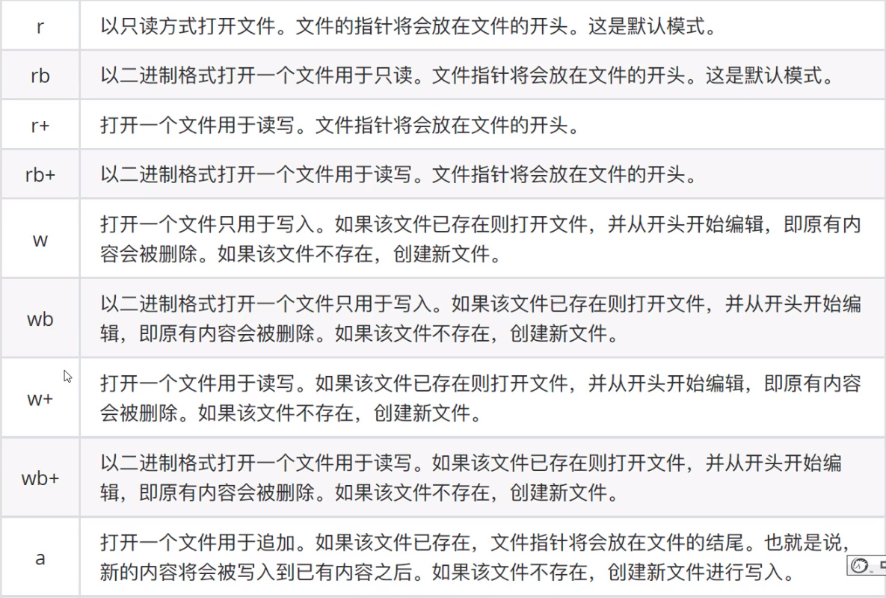

# 二十、高阶函数

==把函数作为参数传入==，这样的函数称为高阶函数，高阶函数是函数式编程的体现。函数式编程就是指这种高度抽象的编程范式。

## 20.1 ==体验高阶函数==

在python中，`abs()` 函数可以完成对数字求绝对值计算

```python
abs(-10) # 10
```

`round()` 函数可以完成对数字的四舍五入计算

```python
round(1.2) # 1
round(1.9) # 2
```

需求：任意两个数字，按照指定要求整理数字后再进行求和计算。

- **方法1**

```python
def add_num(a,b):
    return abs(a) + abs(b)
result = add_num(-1,2)
print(result) # 3
```

- **方法2**：f是第三个参数，用来接收将来传入的函数

```python
def sum_num(a,b,f):
    return f(a) +f(b)
result = sum_num(-1,2,abs)
print(result) #3

result2 = sum_num(1.1,1.3,round)
print(result2)
```

注意：两种方法对比之后，发现，方法2的代码会更加简洁，函数灵活性更高。

函数式编程大量使用函数，减少了代码的重复，因此程序比较短，开发速度较快。

## 20.2 内置高阶函数

### 20.2.1 map()

`map(func,lst)` ，将传入的函数变量func作用到st变量的每个元素中，并将结果组成新的列表（Python2）/
迭代器（Python3）返回。

需求：计算 `1ist1` 序列中各个数字的2次方。

```python
list1 = [1,2,3,4,5]
def func(x):
    return x**2

result = map(func,list1)

print(result) # <map object at 0x0000024DA11BC438>
print(list(result)) # [1, 4, 9, 16, 25]
"""
1、准备列表
2、准备2次方计算的函数
3、调用map
"""
```


### 20.2.2 reduce()

`reduce(func,lst)`，其中func必须有两个参数。每次func计算的结果继续和序列的下一个元素做累计计算。

注意：`reduce()` 传入的参数func必须接收**2个参数。**

需求：计算 `list1` 序列中各个数字的累加和

```python

import functools
list1 = [1,2,3,4,5]
def func(a,b):
    return  a+b

result = functools.reduce(func,list1)
print(result) # 15
```


### 20.2.3 filter()

`filter(func,lst)` 函数用于过滤序列，过滤掉不符合条件的元素，返回一个filter对象。如果要转换为列表，可以使用 `list()` 来转换。

```python
list1 = [1,2,3,4,5,6,7,8,9,10]

def func(x):
    return x %2 ==0 # 求偶数

result = filter(func,list1)
print(result) # <filter object at 0x000002015D4AC438>
print(list(result)) # [2, 4, 6, 8, 10]
```

## 20.3 总结

- 递归

    函数内部自己调用自己

    必须有出口

- lambda

    语法

    ```python
    lambda 参数列表 ： 表达式
    ```

    lambda的参数形式

    无参数

    ```python
    lambda : 表达式
    ```

    一个参数

    ```python
    lambda 参数：表达式
    ```

    默认参数

    ```python
    lambda key= value:表达式
    ```

    不定长位置参数

    ```python
    lambda *args : 表达式
    ```

    不定长关键字参数

    ```python
    lambda **kwargs:表达式
    ```

- 高阶函数

    作用：把函数作为参数传入，简化代码

    内置高阶函数：map()，reduce()，filter()


# 二十一、文件

**目标**

- 文件操作的作用

- 文件的基本操作

    打开

    读取

    关闭

- 文件备份

- 文件和文件夹的操作

## 21.1 文件操作的作用

**思考：**什么是文件？文件操作包含什么？

**答：**打开、关闭、读、写、复制

**思考：**文件操作的的作用是什么？

**答：**读取内容、写入内容、备份内

**总结：**文件操作的作用就是把一些内容数据）存储存放起来，可以让程序下一次执行的时候直接使
用，而不必重新制作一份，省时省力。

---

## 21.2 文件的基本操作

### 21.2.1 文件操作步骤

1、打开文件

2、读写等操作

3、关闭文件

注意：可以只打开和关闭文件，不进行任何读写操作。

```python
f = open('test.txt','w')
f.write('aaa')
f.close()
```


----

**1、打开**

在python，使用open函数，可以打开一个已经存在的文件，或者创建一个新文件，语法如下：

```python
open(name,mode)
```

name：是要打开的目标文件名的字符串（可以包含文件所在的具体路径）。

mode：设置打开文件的模式（访问模式：只读、写入、追加等。

**2、打开文件模式之读访问模式**

 

```python
# r 如果文件不存在，就会报错;r只是读
f = open('test.txt','r')
f.close()

# w 如果文件不存在，新建文件;w会覆盖式写入
f = open('test.txt','w')
f.write('aa')
f.close()

# a 追加，如果文件不存在，新建文件；会以追加的方式写入文件。
f = open('text.txt','a')
f.write('bbbb')
f.close()

# 访问模式参数是否可以省略   如果省略表示访问默认为r，
f = open('test.txt')
f.close()
```

### 21.2.2 读

- read()

```
文件对象.read(num)
```

num表示要从文件中读取的数据的长度（单位是字节），如果没有传入num，那么就表示读取文
件中所有的数据。

```python
f = open('test.txt')
#content = f.read()
content = f.read(2)
print(content)

f.close()
```

1、文件内容如果换行，底层有\n,会有字节占位，导致read书写参数读取出来的眼睛看到的个数和参数值不匹配。

2、read()不写参数读取所有内容。

----

- readlines()

readlines可以按照行的方式把整个文件中的内容进行一次性读取，并且返回的是一个列表，其中每一行
的数据为一个元素。

```python
f = open('test.txt','r')
content = f.readlines()
print(content) # ['aaa\n', 'bbb\n', 'ccc']

f.close() 
```

---

- readline()

readline()一次读取一行内容

```python
f = open('test.txt','r')
content = f.readline()
print(f'第一行：{content}')

content = f.readline()
print(f'第二行：{content}')

f.close()
"""
第一行：aaa
第二行：bbb
"""
```

### 21.2.3 访问模式的特点

```python
# 1、r+ 和 w+ a+区别
# 2、文件指针对数据读取的影响

# r+：r没有该文件则会报错，文件指针在开头，所以能读取出来数据
f = open('test.txt', 'r+')
# w+：没有该文件会新建该文件，w特点：文件指针在开头，用新内容覆盖原内容
f = open('test.txt', 'w+')

#a+：没有该文件会新建该文件；文件指针在结尾，无法读取数据（文件指针后面没有数据）
f = open('test.txt', 'a+')

con  =f.read()
print(con)
f.close()
```

### 21.2.4 seek()

**作用：**用来移动文件指针

**语法如下：**

```python
文件对象.seek(偏移量，起始位置)
```

> 起始位置：
>
> - 0：文件开头
> - 1：当前位置
> - 2：文件结尾


```python
"""
语法：文件对象.seek(偏移量，起始位置) 0开头1当前2结尾
目标：
    1. r改变文件指针位置：改变读取数据开始位置或把文件指针放结尾（无法读取数据）
    2. a改变文件指针位置，做到可以读取出来数据
"""
f = open('test.txt','r+')
# 1、改变读取数据起始位置
# f.seek(2,0)
# 1、把文件指针放结尾（无法读取数据）
# f.seek(0,2)

f = open('test.txt','a+')
#2. a改变文件指针位置，做到可以读取出来数据
f.seek(0,0)


con = f.read()
print(con)
f.close()

```

## 21.3 文件备份

###21.3.1 实现

需求：用户输入当前目录下任意文件名，程序完成对该文件的备份功能（备份文件名为xx[备份]后缀，例
如：test[备份].txt）。

**步骤**

1. 接收用户输入的文件名
2. 规划备份文件名
3. 备份文件写入数据

**代码实现**

1、接收用户输入目标文件名

```python
old_name = input('请输入您要备份的文件名：')
```

2、规划备份文件名

​      2.1 提取目标文件后缀

​      2.2 组织备份的文件名，xx[备份]后缀

```python
# 2. 规划备份文件名
# 2.1 提取目标文件后缀
# == 找到名字中的点 -- 名字和后缀分离--最右侧的点才是后缀的点 -- 字符串查找某个子串rfind
index = old_name.rfind('.') # .
print(index)

# 2.2 组织备份的文件名，xx[备份]后缀   就文件名+[备份]+后缀
# 原名字就是字符串中的一部分子串 -- 切片[开始：结束：步长]
# print(old_name[:index])
# print(old_name[index:])
new_name = old_name[:index] + '[备份]' + old_name[index:]
print(new_name)

```

3、备份文件写入数据

3.1 打开源文件和备份文件

3.2 将源文件数据写入备份文件

3.3 关闭文件

```python
# 3. 备份文件写入数据
# 3.1 打开文件
old_f = open(old_name,'rb')
new_f = open(new_name,'wb')

# 3.2 将原文件数据写入备份文件
# 如果不确定文件大仙，循环读取写入，当读取出来的数据没有了终止循环
while True:
    con = old_f.read(1024)
    if len(con) ==0:
        break
    new_f.write(con)

# 3.3 关闭文件
old_f.close()
new_f.close()
```

### 21.3.2 思考

如果用户输入.txt，这是一个无效文件，程序如何更改才能限制只有有效的文件名才能备份？

答：添加条件判断即可。

```python
old_name = input('请输入您要备份的文件名：')
index = old_name.rfind('.')

if index>0:
    postfix = old_name[index:]
new_name = old_name[:index] + '[备份]' +postfix

old_f = open(old_name, 'rb')
new_f = open(new_name, 'wb')

while True:
    con = old_f.read(1023)
    if len(con) == 0:
        break
    new_f.write(con)
 # 3.3 关闭文件
old_f.close()
new_f.close()   
```


# 二十二、文件函数操作

在 Python中文件和文件夹的操作要借助os模块里面的相关功能，具体步骤如下：

1、导入os模块

```
import os
```

2、使用os模块相关功能

```
os.函数名()
```

##  22.1 文件操作

### 22.1.1 文件重命名

```python
# os.rename(目标文件名，新文件名)
import os

# 1、rename():重命名
os.rename('test.txt', 'text.txt')
```


### 22.1.2 删除文件

```python
# 2、renove():删除文件
os.remove('test[备份].txt')
```


## 22.2 文件夹操作

### 22.2.1 创建文件夹

```python
os.mkdir(文件夹名字)
import os
os.mkdir('aa')
```


### 22.2.2 删除文件夹

```python
os,rmdir(文件夹名字)
import os
os.rmdir('aa')
```


### 22.2.3 获取当前目录

```python 
os.getcwd()
import os
print(os.getcwd()) # F:\Pycharm\Pycharm_workstation\python系统学习
```


### 22.2.4 改变默认目录

```python
os.chdir(目录)
import os
# 需求：在aa里面创建bb文件夹：1、切换到aa。 2创建bb
os.mkdir('aa')
os.chdir('aa')
os.mkdir('bb')

```


### 22.2.5 获取目录列表

```python
os.listdir(目录)
import os
# listdir():获取某个文件夹下所有文件，返回一个列表
print(os.listdir()) #
print(os.listdir('aa'))# 获取aa文件夹下。。。。
```

 ## 22.3 应用案例

需求：批量修改文件名，既可添加指定字符串，又能删除指定字符串。

- 步骤

    1、设置添加删除字符串的的标识

    2、获取指定目录的所有文件

    3、将原有文件名添加/删除指定字符串，构造新名字

    4、os. rename（）重命名

- 代码

```python
import os
# 1、找到所有文件，获取指定文件夹的目录列表 -- listdir()
file_list = os.listdir()
print(file_list)

# 2、构造名字
for i in file_list:
    # new_name = 'python_'+原文件i
    new_name = 'python_' + i
    # 3、重命名
    os.rename(new_name)
```

```python
# 1、将指定文件夹所有文件重命名 python xxx
# 2、删除python_ 重命名：

import os
# 构造条件的数据
flag = 1

# 1、找到所有文件，获取指定文件夹的目录列表 -- listdir()
file_list = os.listdir()
print(file_list)

# 2、构造名字
for i in file_list:
    if flag ==1:
        # new_name = 'python_'+原文件i
        new_name = 'python_' + i
    #
    elif flag ==2:
        # 删除前缀
        num = len('python_')
        new_name = i[num:]
    #  3、重命名
    os.rename(new_name)
```

## 22.4 总结

- **文件操作步骤**

    打开

    ```
    文件对象= open(目标文件，访问模式)
    ```

    操作：读

    ```
    文件对象.read()
    文件对象.readlines()
    文件对象.readline()
    ```

    操作：写

    ```
    文件对象.write()
    ```

    操作：seek()

    关闭

    ```
    文件对象.close()
    ```

- **主要访问模式**

    w：写，文件不存在则新建该文件

    r：读，文件不存在则报错

    a：追加

- **文件和文件夹操作**

    重命名：os.rename()

    获取当前目录：os.getcwd()

    获取目录列表：os.listdir()


